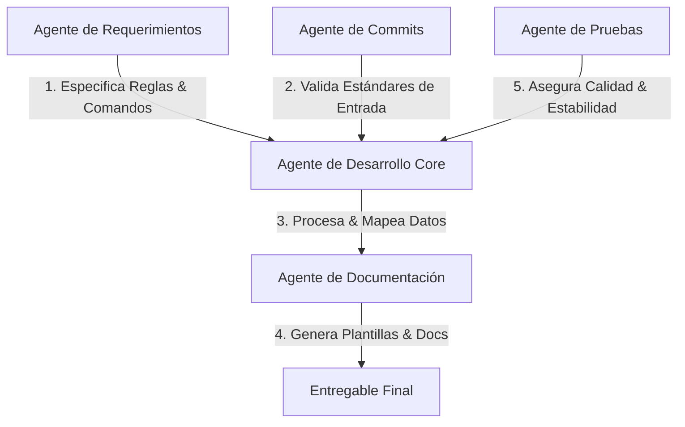

# Registro de Agentes - CLI de Documentación Automática

Este directorio contiene las definiciones de rol, responsabilidades y alcances de cada uno de los agentes especializados para el desarrollo del proyecto.

## Mapa de Agentes

| Agente | Documento de Definición | Enfoque Principal |
| :--- | :--- | :--- |
| **Requerimientos (Product Owner)** | [requirements_agent.md](file:///c:/Users/User/Desktop/Laboratorio/gitdoc/.agents/requirements_agent.md) | Historias de usuario, especificación del linter de negocio y mapeo de flujos. |
| **Desarrollo Core (Developer)** | [developer_agent.md](file:///c:/Users/User/Desktop/Laboratorio/gitdoc/.agents/developer_agent.md) | Implementación en Node.js puro (ES Modules), commander, simple-git y lógica del pipeline. |
| **Pruebas (QA Agent)** | [testing_agent.md](file:///c:/Users/User/Desktop/Laboratorio/gitdoc/.agents/testing_agent.md) | Suite de pruebas unitarias y de integración, mock de git y cobertura de casos extremos. |
| **Commits Convencionales** | [committer_agent.md](file:///c:/Users/User/Desktop/Laboratorio/gitdoc/.agents/committer_agent.md) | Validación de Conventional Commits, githooks (`commit-msg`) y guías de contribución. |
| **Documentación (Docs Agent)** | [documentation_agent.md](file:///c:/Users/User/Desktop/Laboratorio/gitdoc/.agents/documentation_agent.md) | Diseño de plantillas de renderizado (Handlebars/EJS) y mantenimiento del README/guía. |

## Flujo de Trabajo Colaborativo

