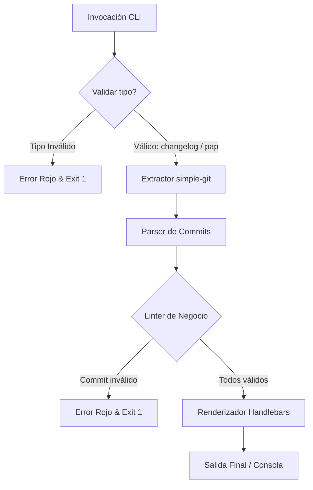

# 🚀 tu-doc-cli — CLI de Documentación Automática

`tu-doc-cli` es una herramienta de línea de comandos (CLI) diseñada para automatizar la creación de CHANGELOGs y PAPs (Procedimiento de Puesta en Producción) a partir de los commits de Git, adhiriéndose de manera estricta al estándar de **Conventional Commits**.

Desarrollada de manera 100% determinista usando **Node.js puro (ES Modules)**, esta herramienta procesa el historial local de Git mediante analizadores estáticos sin recurrir a llamadas externas de Inteligencia Artificial.

---

## 📈 Estado del Proyecto (Avance Actual)

Actualmente hemos completado con éxito el **Hito 3: Motor de Validación Estática - Linter**.

| Hito | Estado | Descripción |
| :--- | :---: | :--- |
| **Hito 1: CLI Operativo con Validación Estricta** | 🟢 Completado | Estructura de consola configurada con validación estricta de parámetros y control de salida. |
| **Hito 2: Extracción y Parseo Semántico de Git** | 🟢 Completado | Integración con `simple-git` y `conventional-commits-parser` con validación de casos borde (sin repo, sin commits). |
| **Hito 3: Motor de Validación Estática - Linter** | 🟢 Completado | Linter de negocio con validación de campos obligatorios, tipos permitidos y filtro léxico case-insensitive sobre vocabulario corporativo prohibido. |
| **Hito 4: Agrupación, Renderizado y Generación** | ⚪ Pendiente | Renderizado final de plantillas Handlebars y flag de simulación `--dry-run`. |
| **Hito 5: Suite de Pruebas y Control de Calidad** | ⚪ Pendiente | Cobertura total de pruebas y mocks de Git. |

---

## 📖 Guía del Usuario

El CLI expone el comando `generate` para procesar y compilar la documentación.

### Requisitos Previos
- Node.js v18 o superior.
- pnpm / npm.

### Instalación / Ejecución Local
Para probar el ejecutable local en desarrollo, puedes ejecutarlo directamente usando Node:
```bash
node bin/cli.js generate <tipo> [opciones]
```

---

### Comando Principal: `generate`

Estructura del comando:
```bash
tu-doc-cli generate <tipo> [opciones]
```

#### 1. Argumento obligatorio: `<tipo>`
Define el tipo de documento a generar. Solo se aceptan los siguientes valores:
*   `changelog`: Para generar el historial general de cambios del software de cara al usuario final.
*   `pap`: Para generar el Procedimiento de Puesta en Producción con los detalles de despliegue e infraestructura.

> [!WARNING]
> Si se especifica un tipo inválido o ausente (por ejemplo, `tu-doc-cli generate invalid`), el programa imprimirá un error descriptivo en color rojo en `stderr` y abortará la ejecución con un código de salida `1`.

#### 2. Opciones y Banderas Disponibles
*   `--from <tag/commit/hash>`: Especifica la referencia de inicio (tag, commit hash o rama) para el rango del historial. Si no se provee, el CLI detectará automáticamente el último tag y extraerá a partir de él (o desde el origen del historial si no hay tags).
*   `--to <tag/commit/hash>`: Especifica la referencia de fin (tag, commit hash o rama) para el rango del historial. Si no se provee, se asume `HEAD` por defecto.
*   `--scope <nombre>`: Filtra y aísla la generación de documentación a un módulo o componente específico.
*   `--dry-run`: Permite simular la operación imprimiendo el resultado directamente en la terminal sin escribir físicamente ningún archivo.

---

### Ejemplos de Uso

#### ✅ Previsualizar commits parseados y validados
```bash
node bin/cli.js generate changelog --dry-run
```
*Salida esperada (JSON con commits limpios):*
```json
[
  {
    "hash": "e153cf4...",
    "type": "feat",
    "scope": "linter",
    "subject": "implement business linter engine",
    "body": null,
    "notes": []
  }
]
```

#### ✅ Filtrar por rango de commits
```bash
node bin/cli.js generate changelog --from v1.0.0 --to HEAD --dry-run
```

#### ❌ Error: tipo inválido
```bash
node bin/cli.js generate manual
```
*Salida (en color rojo en stderr):*
```
Error: El tipo de documento "manual" no es válido. Debe ser "changelog" o "pap".
```

---

## 🛡️ Linter de Negocio (Hito 3)

El CLI valida automáticamente el vocabulario de cada commit antes de generar documentación. Si algún commit contiene términos prohibidos o está mal formado, **el pipeline se interrumpe con exit code 1**.

### Reglas configuradas en `config/rules.json`

#### Tipos de commit permitidos (`allowedTypes`)
`feat`, `fix`, `docs`, `style`, `refactor`, `perf`, `test`, `build`, `ci`, `chore`, `revert`

#### Campos obligatorios
Todo commit debe tener `type` y `subject` definidos.

#### Términos prohibidos (`forbiddenTerms`)
La búsqueda es **insensible a mayúsculas** y aplica sobre `subject` y `body`:

| Término bloqueado | Sugerencia formal |
| :--- | :--- |
| `fraude` | `riesgoso` |
| `hack` | `solución temporal documentada` |
| `error estúpido` | `corrección de flujo` |
| `temporal` | `ajuste de diseño` |

#### Ejemplo de error del linter
```bash
node bin/cli.js generate changelog --dry-run
```
*Si hay un commit con "hack" en el subject:*
```
❌ El linter de negocio encontró commits inválidos:

  Commit: abc123 — fix(api): used a hack to bypass auth
    → El commit contiene el término prohibido "hack". Sugerencia: use "solución temporal documentada" en su lugar.
```

### Agregar o modificar reglas
Edita directamente el archivo [`config/rules.json`](./config/rules.json):
```json
{
  "allowedTypes": ["feat", "fix", "docs", ...],
  "requiredFields": ["type", "subject"],
  "forbiddenTerms": {
    "tu-termino": "tu-sugerencia-formal"
  }
}
```
Los cambios se aplican inmediatamente sin recompilar.

---

### Ejecutar la suite de pruebas

```bash
npm test
```
*Salida esperada:*
```
✔ lintCommit - commit válido completo
✔ lintCommit - falta el campo type (null)
✔ lintCommit - falta el campo subject (null)
✔ lintCommit - type no pertenece a allowedTypes
✔ lintCommit - término prohibido "fraude" en subject
✔ lintCommit - término prohibido "hack" en body
✔ lintCommit - término prohibido en mayúsculas (case-insensitive)
✔ lintCommit - múltiples errores simultáneos
... (23 tests en total)
```

---

## 🛠️ Arquitectura y Flujo



---

## 🤝 Convenciones del Repositorio

Para contribuir al desarrollo, todos los agentes y desarrolladores deben respetar las siguientes directrices:

### 1. Convención de Ramas
El formato de ramas requerido es: `<tipo-de-cambio>/<descripción-corta-en-kebab-case>`
*   `feat/` - Nuevas características (ej. `feat/linter-engine`).
*   `fix/` - Correcciones de errores (ej. `fix/empty-git-log`).
*   `docs/` - Actualizaciones de documentación (ej. `docs/user-guide`).
*   `test/` - Adición de pruebas (ej. `test/unit-linter`).

### 2. Convención de Commits
Se sigue la especificación de **Conventional Commits**:
```text
<tipo>(<scope-opcional>): <descripción corta en imperativo>
```
*Ejemplos:*
- `feat(linter): implement business linter engine`
- `test(linter): add unit tests for forbidden terms validation`
- `docs(hitos): mark hito 3 as complete`
