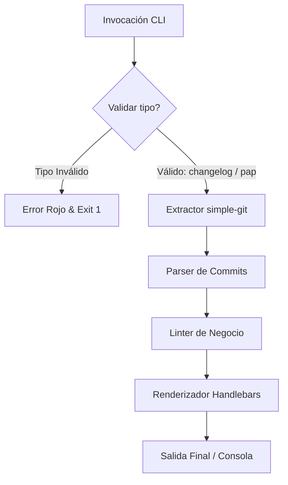

# 🚀 tu-doc-cli — CLI de Documentación Automática

`tu-doc-cli` es una herramienta de línea de comandos (CLI) diseñada para automatizar la creación de CHANGELOGs y PAPs (Procedimiento de Puesta en Producción) a partir de los commits de Git, adhiriéndose de manera estricta al estándar de **Conventional Commits**.

Desarrollada de manera 100% determinista usando **Node.js puro (ES Modules)**, esta herramienta procesa el historial local de Git mediante analizadores estáticos sin recurrir a llamadas externas de Inteligencia Artificial.

---

## 📈 Estado del Proyecto (Avance Actual)

Actualmente hemos completado con éxito el **Hito 1: CLI Operativo con Validación Estricta**.

| Hito | Estado | Descripción |
| :--- | :---: | :--- |
| **Hito 1: CLI Operativo con Validación Estricta** | 🟢 Completado | Estructura de consola configurada con validación estricta de parámetros y control de salida. |
| **Hito 2: Extracción y Parseo Semántico de Git** | 🟡 Pendiente | Integración con `simple-git` y validación de casos borde (sin repo, sin commits). |
| **Hito 3: Motor de Validación Estática - Linter** | ⚪ Pendiente | Validación léxica basada en diccionario de términos prohibidos y alternativos. |
| **Hito 4: Agrupación, Renderizado y Generación** | ⚪ Pendiente | Renderizado final de plantillas Handlebars y flag de simulación `--dry-run`. |
| **Hito 5: Suite de Pruebas y Control de Calidad** | ⚪ Pendiente | Cobertura total de pruebas y mocks de Git. |

---

## 📖 Guía del Usuario (Hasta Ahora)

El CLI expone el comando `generate` para procesar y compilar la documentación.

### Requisitos Previos
- Node.js v18 o superior.
- pnpm / npm.

### Instalación / Ejecución Local
Para probar el ejecutable local en desarrollo, puedes ejecutarlo directamente usando Node:
```bash
node bin/cli.js generate <tipo> [opciones]
```

---

### Comando Principal: `generate`

Estructura del comando:
```bash
tu-doc-cli generate <tipo> [opciones]
```

#### 1. Argumento obligatorio: `<tipo>`
Define el tipo de documento a generar. Solo se aceptan los siguientes valores:
*   `changelog`: Para generar el historial general de cambios del software de cara al usuario final.
*   `pap`: Para generar el Procedimiento de Puesta en Producción con los detalles de despliegue e infraestructura.

> [!WARNING]  
> Si se especifica un tipo inválido o ausente (por ejemplo, `tu-doc-cli generate invalid`), el programa imprimirá un error descriptivo en color rojo en `stderr` y abortará la ejecución con un código de salida `1`.

#### 2. Opciones y Banderas Disponibles
*   `--desde <tag/commit>`: Especifica la referencia de inicio (tag, rama o hash) del historial. Si no se provee, el CLI detectará automáticamente el último tag y extraerá a partir de él (o todo el historial si no hay tags).
*   `--scope <nombre>`: Filtra y aísla la generación de documentación a un módulo o componente específico.
*   `--dry-run`: Permite simular la operación imprimiendo el resultado directamente en la terminal sin escribir físicamente ningún archivo.

---

### Ejemplos de Uso

**Generar un changelog con validación estricta exitosa:**
```bash
node bin/cli.js generate changelog --desde v1.0.0 --dry-run
```
*Salida:*
```text
Generando changelog... { desde: 'v1.0.0', dryRun: true }
```

**Ejemplo de error de validación (argumento no soportado):**
```bash
node bin/cli.js generate manual
```
*Salida (en color rojo):*
```text
Error: El tipo de documento "manual" no es válido. Debe ser "changelog" o "pap".
```

---

## 🛠️ Arquitectura y Flujo



---

## 🤝 Convenciones del Repositorio

Para contribuir al desarrollo, todos los agentes y desarrolladores deben respetar las siguientes directrices:

### 1. Convención de Ramas
El formato de ramas requerido es: `<tipo-de-cambio>/<descripción-corta-en-kebab-case>`
*   `feat/` - Nuevas características (ej. `feat/cli-validation`).
*   `fix/` - Correcciones de errores (ej. `fix/empty-git-log`).
*   `docs/` - Actualizaciones de documentación (ej. `docs/user-guide`).
*   `test/` - Adición de pruebas (ej. `test/integration-cli`).

### 2. Convención de Commits
Se sigue la especificación de **Conventional Commits**:
```text
<tipo>(<scope-opcional>): <descripción corta en imperativo>
```
*Ejemplos:*
- `feat(cli): add validation for generate command tipo argument`
- `test(cli): add integration tests for tipo validation`
- `docs(hitos): document git error handling and edge cases`
