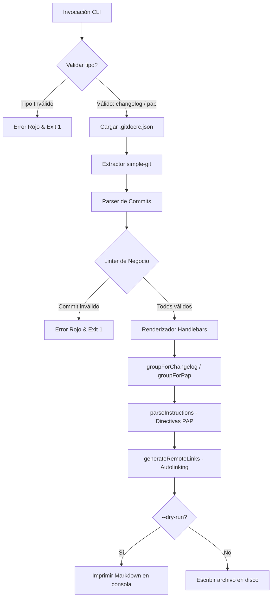

# 🚀 tu-doc-cli — CLI de Documentación Automática

`tu-doc-cli` es una herramienta de línea de comandos (CLI) diseñada para automatizar la creación de CHANGELOGs y PAPs (Procedimiento de Puesta en Producción) a partir de los commits de Git, adhiriéndose de manera estricta al estándar de **Conventional Commits**.

Desarrollada de manera 100% determinista usando **Node.js puro (ES Modules)**, esta herramienta procesa el historial local de Git mediante analizadores estáticos sin recurrir a llamadas externas de Inteligencia Artificial.

---

## 📈 Estado del Proyecto (Avance Actual)

Actualmente hemos completado con éxito el **Hito 7: PAP Enriquecido y Trazabilidad Remota**.

| Hito | Estado | Descripción |
| :--- | :---: | :--- |
| **Hito 1: CLI Operativo con Validación Estricta** | 🟢 Completado | Estructura de consola configurada con validación estricta de parámetros y control de salida. |
| **Hito 2: Extracción y Parseo Semántico de Git** | 🟢 Completado | Integración con `simple-git` y `conventional-commits-parser` con validación de casos borde (sin repo, sin commits). |
| **Hito 3: Motor de Validación Estática - Linter** | 🟢 Completado | Linter de negocio con validación de campos obligatorios, tipos permitidos y filtro léxico case-insensitive sobre vocabulario corporativo prohibido. |
| **Hito 4: Agrupación, Renderizado y Generación** | 🟢 Completado | Renderizado final de plantillas Handlebars con secciones en español, breaking changes aislados y flag de simulación `--dry-run`. |
| **Hito 5: Suite de Pruebas y Control de Calidad** | 🟢 Completado | 63 pruebas (unitarias + integración) con mocks de Git. Runner nativo de Node.js (`node --test`). |
| **Hito 6: Personalización, Rutas Flexibles y Verbosidad** | 🟢 Completado | Soporte para `.gitdocrc.json`, flags `--output`, `--template` y `--verbose` con inyección del `body` en el Changelog. |
| **Hito 7: PAP Enriquecido y Trazabilidad Remota** | 🟢 Completado | PAP estructurado con secciones técnicas por directiva de commit (`RUN:`, `ROLLBACK:`, `VERIFY:`) y autolinking de hashes e issues a repositorio remoto. |

---

## 📖 Guía del Usuario

El CLI expone el comando `generate` para procesar y compilar la documentación.

### Requisitos Previos
- Node.js v18 o superior.
- pnpm / npm.

### Instalación / Ejecución Local
Para probar el ejecutable local en desarrollo, puedes ejecutarlo directamente usando Node:
```bash
node bin/cli.js generate <tipo> [opciones]
```

---

### Comando Principal: `generate`

Estructura del comando:
```bash
tu-doc-cli generate <tipo> [opciones]
```

#### 1. Argumento obligatorio: `<tipo>`
Define el tipo de documento a generar. Solo se aceptan los siguientes valores:
*   `changelog`: Para generar el historial general de cambios del software de cara al usuario final.
*   `pap`: Para generar el Procedimiento de Puesta en Producción con los detalles de despliegue e infraestructura.

> [!WARNING]
> Si se especifica un tipo inválido o ausente (por ejemplo, `tu-doc-cli generate invalid`), el programa imprimirá un error descriptivo en color rojo en `stderr` y abortará la ejecución con un código de salida `1`.

#### 2. Opciones y Banderas Disponibles

| Opción | Alias | Descripción |
| :--- | :---: | :--- |
| `--from <ref>` | | Referencia de inicio del rango (tag, hash o rama). Por defecto: último tag o inicio del historial. |
| `--to <ref>` | | Referencia de fin del rango. Por defecto: `HEAD`. |
| `--scope <nombre>` | | Filtra la documentación a un módulo/componente específico. |
| `--output <ruta>` | `-o` | Escribe el archivo generado en la ruta indicada (crea directorios intermedios). |
| `--template <ruta>` | `-t` | Carga un archivo `.hbs` personalizado en lugar de la plantilla predeterminada. |
| `--verbose` | `-v` | Inyecta el `body` de cada commit debajo de su entrada en el Changelog. También incluye tipos menores (`docs`, `chore`, etc.). |
| `--dry-run` | | Simula la operación imprimiendo el resultado en la terminal sin escribir ningún archivo. |

---

### Ejemplos de Uso

#### ✅ Previsualizar el CHANGELOG generado
```bash
node bin/cli.js generate changelog --dry-run
```

#### ✅ Previsualizar el PAP generado
```bash
node bin/cli.js generate pap --dry-run
```

#### ✅ Filtrar por rango de commits
```bash
node bin/cli.js generate changelog --from v1.0.0 --to HEAD --dry-run
```

#### ✅ Modo verboso (incluye body de commits)
```bash
node bin/cli.js generate changelog --verbose --dry-run
```

#### ✅ Guardar en ruta personalizada
```bash
node bin/cli.js generate changelog --output docs/release/CHANGELOG.md
```

#### ✅ Usar plantilla Handlebars propia
```bash
node bin/cli.js generate changelog --template my-templates/changelog.hbs --dry-run
```

#### ❌ Error: tipo inválido
```bash
node bin/cli.js generate manual
```
*Salida (en color rojo en stderr):*
```
Error: El tipo de documento "manual" no es válido. Debe ser "changelog" o "pap".
```

---

## 🛡️ Linter de Negocio (Hito 3)

El CLI valida automáticamente el vocabulario de cada commit antes de generar documentación. Si algún commit contiene términos prohibidos o está mal formado, **el pipeline se interrumpe con exit code 1**.

### Reglas configuradas en `config/rules.json`

#### Tipos de commit permitidos (`allowedTypes`)
`feat`, `fix`, `docs`, `style`, `refactor`, `perf`, `test`, `build`, `ci`, `chore`, `revert`

#### Campos obligatorios
Todo commit debe tener `type` y `subject` definidos.

#### Términos prohibidos (`forbiddenTerms`)
La búsqueda es **insensible a mayúsculas** y aplica sobre `subject` y `body`:

| Término bloqueado | Sugerencia formal |
| :--- | :--- |
| `fraude` | `riesgoso` |
| `hack` | `mitigación` |
| `error estúpido` | `corrección de flujo` |
| `temporal` | `ajuste de diseño` |

#### Ejemplo de error del linter
```bash
node bin/cli.js generate changelog --dry-run
```
*Si hay un commit con "hack" en el subject:*
```
❌ El linter de negocio encontró commits inválidos:

  Commit: abc123 — fix(api): used a hack to bypass auth
    → El commit contiene el término prohibido "hack". Sugerencia: use "mitigación" en su lugar.
```

### Personalización con `.gitdocrc.json` (Hito 6)

Crea un archivo `.gitdocrc.json` en la raíz del proyecto para sobreescribir o extender las reglas base:

```json
{
  "allowedTypes": ["feat", "fix", "docs"],
  "forbiddenTerms": {
    "workaround": "solución documentada"
  },
  "remoteUrl": "https://github.com/usuario/repo"
}
```

Los valores se **fusionan recursivamente** sobre `config/rules.json`. Los cambios se aplican inmediatamente sin recompilar.

> [!TIP]
> La clave `remoteUrl` activa el autolinking de hashes de commit e issues (`#NNN`) en los documentos generados (ver Hito 7).

---

## 🔗 Trazabilidad Remota y PAP Enriquecido (Hito 7)

### Autolinking de Commits e Issues

Si configuras `remoteUrl` en `.gitdocrc.json`, los hashes de commits y referencias a issues se convierten automáticamente en hipervínculos Markdown:

| Patrón detectado | Resultado |
| :--- | :--- |
| Hash de 7 chars (`abc1234`) | `[abc1234](https://github.com/.../commit/abc1234)` |
| Hash de 40 chars (hash completo) | `[abc1234](https://github.com/.../commit/abc...40)` |
| Referencia de issue (`#42`) | `[#42](https://github.com/.../issues/42)` |

### PAP con Secciones Técnicas Estructuradas

El generador de PAP extrae automáticamente directivas técnicas del `body` de los commits y las organiza en cuatro secciones:

| Directiva en el cuerpo del commit | Sección del PAP |
| :--- | :--- |
| `RUN: <comando>` o `MIGRATE: <comando>` | **Ejecución** |
| `ROLLBACK: <comando>` | **Marcha Atrás** |
| `VERIFY: <comando>` | **Pruebas de Humo** |

**Ejemplo de commit con directivas:**
```
ci(docker): setup production deployment pipeline

RUN: docker-compose -f docker-compose.prod.yml up -d
MIGRATE: node scripts/migrate.js --env production
ROLLBACK: docker-compose -f docker-compose.prod.yml down
VERIFY: curl -f http://localhost/health
```

**Salida en el PAP generado:**
```markdown
## Componente: docker

### setup production deployment pipeline (`docker`) (`abc1234`)

**Ejecución:**
- `docker-compose -f docker-compose.prod.yml up -d`
- `node scripts/migrate.js --env production`

**Marcha Atrás:**
- `docker-compose -f docker-compose.prod.yml down`

**Pruebas de Humo:**
- `curl -f http://localhost/health`
```

---

## 🧪 Suite de Pruebas (Hito 5)

### Ejecutar la suite de pruebas

```bash
node --test --experimental-test-module-mocks tests/**/*.test.js
```

*Salida esperada (63 tests):*
```
✔ CLI - should fail with exit code 1 and red error when tipo is invalid
✔ CLI - should succeed with exit code 0 when tipo is changelog
✔ CLI - should support --verbose
✔ getCommits - successful extraction of all commits
✔ lintCommit - commit válido completo
✔ parseInstructions - extrae directivas RUN, ROLLBACK y VERIFY del body
✔ generateRemoteLinks - convierte hash de 7 caracteres en hipervínculo
... (63 tests en total)

ℹ tests 63
ℹ pass 63
ℹ fail 0
```

---

## 🛠️ Arquitectura y Flujo



---

## 🤝 Convenciones del Repositorio

Para contribuir al desarrollo, todos los agentes y desarrolladores deben respetar las siguientes directrices:

### 1. Convención de Ramas
El formato de ramas requerido es: `<tipo-de-cambio>/<descripción-corta-en-kebab-case>`
*   `feat/` - Nuevas características (ej. `feat/linter-engine`).
*   `fix/` - Correcciones de errores (ej. `fix/empty-git-log`).
*   `docs/` - Actualizaciones de documentación (ej. `docs/user-guide`).
*   `test/` - Adición de pruebas (ej. `test/unit-linter`).

### 2. Convención de Commits
Se sigue la especificación de **Conventional Commits**:
```text
<tipo>(<scope-opcional>): <descripción corta en imperativo>

<body opcional con directivas PAP>
RUN: comando de despliegue
ROLLBACK: comando de reversión
VERIFY: comando de verificación
```
*Ejemplos:*
- `feat(linter): implement business linter engine`
- `test(renderer): add unit tests for generateRemoteLinks`
- `docs(hitos): mark hito 7 as complete`
- `ci(docker): setup production pipeline`
