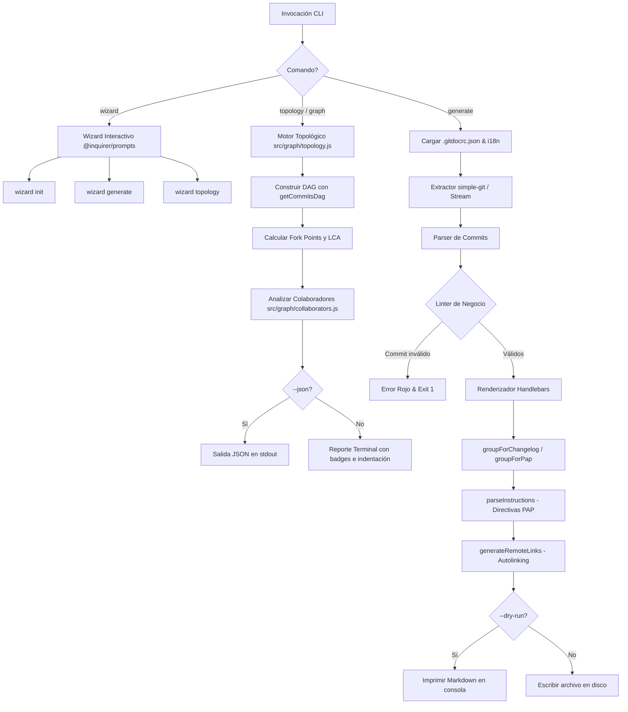

# 🚀 tu-doc-cli — CLI de Documentación Automática / Automated Documentation CLI

[]()
[]()
[]()
[](https://conventionalcommits.org)
[]()

> **Idioma / Language:** [🇪🇸 Español](#-español) | [🇬🇧 English](#-english)

---

# 🇪🇸 Español

`tu-doc-cli` es una herramienta de línea de comandos (CLI) de alto rendimiento diseñada para automatizar la extracción, análisis topológico del repositorio, atribución analítica de colaboradores y generación de documentación técnica (`CHANGELOG` y `PAP`) a partir de los commits de Git, adhiriéndose de manera estricta al estándar de **Conventional Commits**.

Desarrollada de manera 100% determinista usando **Node.js puro (ES Modules)**, esta herramienta procesa el historial local y el Grafo Acíclico Dirigido (DAG) de Git en memoria con un consumo estricto (< 100 MB Heap) y sin recurrir a llamadas externas de Inteligencia Artificial.

---

## 📈 Estado del Proyecto (Hitos 1 al 11)

Actualmente se han completado con éxito todos los hitos de la Fase 1, Fase 2 y Fase 3 (Hito 11):

| Hito | Estado | Descripción |
| :--- | :---: | :--- |
| **Hito 1: CLI Operativo con Validación Estricta** | 🟢 Completado | Estructura de consola con Commander, validación estricta de parámetros y códigos de salida deterministas. |
| **Hito 2: Extracción y Parseo Semántico de Git** | 🟢 Completado | Integración con `simple-git` y `conventional-commits-parser`, manejo de repositorios vacíos o sin tags. |
| **Hito 3: Motor de Validación Estática - Linter** | 🟢 Completado | Linter de negocio con validación de tipos permitidos, campos obligatorios y filtro léxico corporativo case-insensitive. |
| **Hito 4: Agrupación, Renderizado y Generación** | 🟢 Completado | Renderizado modular Handlebars con secciones de tipos, aislamiento de Breaking Changes y simulación con `--dry-run`. |
| **Hito 5: Suite de Pruebas y Control de Calidad** | 🟢 Completado | Suite de pruebas unitarias y de integración con el runner nativo de Node.js (`node --test`) y mocks modulares. |
| **Hito 6: Personalización, Rutas Flexibles y Verbosidad** | 🟢 Completado | Configuración persistente `.gitdocrc.json`, rutas de salida dinámicas, plantillas externas y modo `--verbose`. |
| **Hito 7: PAP Enriquecido y Trazabilidad Remota** | 🟢 Completado | Extracción de directivas técnicas (`RUN:`, `ROLLBACK:`, `VERIFY:`) y autolinking de hashes e issues (`#NNN`). |
| **Hito 8: Asistente Interactivo CLI (Wizard)** | 🟢 Completado | Asistente interactivo guiado paso a paso con `@inquirer/prompts` (`wizard init` y `wizard generate`). |
| **Hito 9: Generador Asíncrono y Streaming** | 🟢 Completado | Pipeline basado en generadores asíncronos para extracción y parseo semántico en memoria constante. |
| **Hito 10: Internacionalización Multilenguaje (i18n)** | 🟢 Completado | Soporte nativo bilingüe (`es` / `en`) para comandos, opciones, errores, plantillas y catálogos extensibles. |
| **Hito 11: Extractor Topológico, Ramas y Colaboradores** | 🟢 Completado | Reconstrucción del DAG de Git, cálculo de ancestros comunes (LCA), clasificación de ramas y métricas analíticas de colaboradores. |

---

## 📖 Guía del Usuario

El CLI expone tres comandos principales:
1. `wizard`: Asistente interactivo guiado por pasos.
2. `generate`: Compilación y renderizado de documentación técnica (`changelog` y `pap`).
3. `topology` (alias `graph`): Análisis del grafo de ramas, bifurcaciones y colaboradores.

### Requisitos Previos
- Node.js v18.0.0 o superior.
- pnpm o npm.
- Git instalado y disponible en el PATH del sistema.

### Instalación / Ejecución Local
Para probar el ejecutable local en desarrollo:
```bash
node bin/cli.js [comando] [opciones]
```

---

## 🧙 1. Asistente Interactivo (`wizard`)

El Asistente Interactivo proporciona una experiencia guiada mediante selección de menús y preguntas:
```bash
node bin/cli.js wizard
```

Al ejecutarse sin subcomandos, el wizard despliega un menú inicial con 3 opciones:
1. **Inicializar / actualizar configuración (`.gitdocrc.json`)**
2. **Generar reporte de documentación (CHANGELOG / PAP)**
3. **Análisis topológico del repositorio, ramas y colaboradores**

También puedes invocar directamente cualquiera de los tres flujos:

### Flujo `wizard init`
Configura interactivamente tu archivo `.gitdocrc.json`:
```bash
node bin/cli.js wizard init
```
- Selección de idioma predeterminado (`es` / `en`).
- Selección de rama base de referencia (ej. `main`, `dev`).
- Selección de tipos permitidos de Conventional Commits.
- Definición de términos prohibidos y sus sugerencias formales.
- URL del repositorio remoto para autolinking de commits e issues.

### Flujo `wizard generate`
Guía paso a paso para generar documentación:
```bash
node bin/cli.js wizard generate
```
- Tipo de documento (`changelog` o `pap`).
- Rango de revisiones (`--from` y `--to`) seleccionable entre los tags y ramas del repo.
- Filtro opcional por `scope`.
- Inyección opcional del cuerpo de los commits (`--verbose`).
- Previsualización en terminal o guardado en disco con confirmación.

### Flujo `wizard topology` (alias `wizard graph`)
Guía interactiva para auditar el grafo de ramas:
```bash
node bin/cli.js wizard topology
# o
node bin/cli.js wizard graph
```
- Selección de la rama base de referencia.
- Aislamiento opcional a una rama específica.
- Filtro opcional por nombre o correo de colaborador.
- Filtro opcional por rango de fechas (`since` y `until`).
- Formato de salida: reporte visual en terminal con insignias o JSON estructurado.

---

## 📄 2. Generación de Documentación (`generate`)

Estructura del comando:
```bash
node bin/cli.js generate <tipo> [opciones]
```

### 1. Argumento obligatorio: `<tipo>`
Define el tipo de documento a generar:
*   `changelog`: Para generar el historial general de cambios de cara al usuario final.
*   `pap`: Para generar el Procedimiento de Puesta en Producción con directivas de infraestructura y despliegue.

> [!WARNING]
> Si se especifica un tipo inválido o ausente (por ejemplo, `node bin/cli.js generate invalid`), el programa imprimirá un error descriptivo en color rojo en `stderr` y abortará la ejecución con código de salida `1`.

### 2. Opciones y Banderas Disponibles
| Opción | Alias | Descripción |
| :--- | :---: | :--- |
| `--from <ref>` | | Referencia de inicio del rango (tag, hash o rama). Por defecto: último tag o inicio del historial. |
| `--to <ref>` | | Referencia de fin del rango. Por defecto: `HEAD`. |
| `--scope <nombre>` | | Filtra la documentación a un módulo o scope específico. |
| `--output <ruta>` | `-o` | Escribe el archivo generado en la ruta indicada (crea directorios intermedios automáticamente). |
| `--template <ruta>` | `-t` | Carga un archivo Handlebars (`.hbs`) personalizado en lugar de la plantilla predeterminada. |
| `--verbose` | `-v` | Inyecta el `body` de cada commit debajo de su entrada en el Changelog e incluye tipos menores (`docs`, `chore`, etc.). |
| `--dry-run` | | Simula la operación imprimiendo el resultado en la terminal sin escribir ningún archivo. |
| `-l, --lang <es\|en>` | | Selecciona el idioma de la ejecución (`es` o `en`). |

### Ejemplos de Uso
```bash
# Previsualizar CHANGELOG en consola
node bin/cli.js generate changelog --dry-run

# Previsualizar PAP en consola
node bin/cli.js generate pap --dry-run

# Filtrar por rango de commits o tags
node bin/cli.js generate changelog --from v1.0.0 --to HEAD --dry-run

# Modo verboso (incluye cuerpo de los commits)
node bin/cli.js generate changelog --verbose --dry-run

# Guardar en archivo
node bin/cli.js generate changelog --output docs/release/CHANGELOG.md

# Usar plantilla personalizada
node bin/cli.js generate changelog --template templates/custom-changelog.hbs --dry-run
```

---

## 🌐 3. Internacionalización Multilenguaje (i18n - Hito 10)

El CLI implementa soporte bilingüe nativo en **español (`es`)** e **inglés (`en`)**. Todos los comandos, opciones de ayuda, mensajes informativos, advertencias, errores y reportes generados se adaptan al idioma configurado.

### Orden de Precedencia Jerárquica
El idioma se determina evaluando estrictamente las siguientes fuentes en orden de prioridad:
1. **Bandera explícita en CLI:** `-l, --lang <es|en>` (ej. `node bin/cli.js generate changelog --lang en`).
2. **Archivo de configuración `.gitdocrc.json`:** Propiedad `"locale": "es"` o `"locale": "en"`.
3. **Variables de entorno del Sistema Operativo:** Detección automática de `LC_ALL`, `LC_MESSAGES` o `LANG`.
4. **Fallback predeterminado:** Inglés (`en`).

### Sobrescritura y Extensión de Catálogos
Puedes personalizar cualquier texto o añadir nuevos términos directamente en tu `.gitdocrc.json` bajo la clave `"i18n"`:

```json
{
  "locale": "es",
  "i18n": {
    "es": {
      "cli": {
        "topology": {
          "header": "🌐 Topología de Git de Mi Empresa",
          "branchesHeading": "Ramas Activas:"
        }
      }
    }
  }
}
```

---

## 🌿 4. Extractor Topológico y Análisis de Colaboradores (Hito 11)

El comando `topology` (alias `graph`) reconstruye el Grafo Acíclico Dirigido (DAG) de Git a partir del historial local para inspeccionar la genealogía de ramas, resolver ancestros comunes (*Lowest Common Ancestor* - LCA), identificar puntos de bifurcación (*fork points*) y computar métricas de colaboración por autor.

### Sintaxis
```bash
node bin/cli.js topology [rama-base] [opciones]
node bin/cli.js graph [rama-base] [opciones]
```

### Opciones de Topología
| Opción | Alias | Descripción |
| :--- | :---: | :--- |
| `[rama-base]` | | Rama base de referencia (ej. `main`, `dev`). Argumento posicional opcional. |
| `-B, --base <rama>` | | Especifica explícitamente la rama base de referencia. |
| `-b, --branch <filtro>` | | Aísla el análisis a una rama específica o por coincidencia parcial. |
| `-a, --author <patrón>` | | Filtra por nombre o correo del colaborador. |
| `--since <YYYY-MM-DD>` | | Filtra commits desde la fecha indicada (inclusivo desde 00:00:00). |
| `--until <YYYY-MM-DD>` | | Filtra commits hasta la fecha indicada (inclusivo hasta 23:59:59). |
| `--json` | | Retorna la estructura topológica completa y las métricas en JSON. |
| `-l, --lang <es\|en>` | | Selecciona el idioma del reporte (`es` o `en`). |

### Clasificación y Semántica de Ramas
*   **Rama Base (`isBase: true`):** Muestra el total acumulado de commits en la historia de la rama de referencia.
*   **Ramas Fusionadas (`[fusionada]` / `[merged]`):**
    Identifica ramas integradas en la base (tanto por commits de merge tradicionales como por *fast-forward*).
    Reporta cuántos commits aportó la rama a la historia (`100% integrados`), el commit de bifurcación real donde nació y cuántos commits de retraso tiene respecto al estado actual de la base (`behind`).
*   **Ramas Divergentes (`[divergente]` / `[diverged]`):**
    Ramas que tienen commits independientes tras la bifurcación. Informa cuántos commits están pendientes de integrar (`ahead`), cuántos commits de retraso tiene la rama respecto a la base (`behind`) y cuántos commits comparten en común (`en común`).
*   **Ramas Activas (`[activa]` / `[active]`):**
    Ramas que van estrictamente por delante de la base y están listas para integrarse.

### Desglose Visual de Commits
Debajo de cada rama, el reporte lista los commits relevantes:
*   `↳ Pendientes de integrar en <base> (N):` Despliega los commits de la rama que aún no forman parte de la base.
*   `↳ Commits aportados/integrados (N):` Despliega los commits que la rama aportó a la base común.

### Atribución Analítica de Colaboradores
Para cada autor detectado, el reporte calcula:
*   Volumen total de commits.
*   Desglose por tipos de Conventional Commits (`feat`, `fix`, `test`, `docs`, `refactor`, etc.).
*   Lista de `scopes` trabajados.
*   Ramas en las que participó activamente.

### Ejemplo de Salida Terminal
```text
🌐 Gitdoc — Análisis Topológico y Colaboradores
📌 Rama Base: main
🌿 Ramas Totales: 2 (0 activas, 0 fusionadas, 2 divergentes)

Ramas:
  dev [divergente] (bifurcada en f74cb12) — 31 pendientes (ahead), 4 detrás (behind) • 30 en común
    ↳ Pendientes de integrar en main (31):
      • d3a660a fix(cli): preservar rama base posicional al combinar con filtro -b
      • 4eb5761 feat(topology): soportar seleccion de rama base via bandera -B
      • 7989af4 feat(cli): soportar rama opcional como argumento posicional
      • 200124e feat(i18n): localizar comando topology y mensajes de error
      ... (+27 más)
  origin/dev [divergente] (bifurcada en f74cb12) — 18 pendientes (ahead), 4 detrás (behind) • 30 en común
    ↳ Pendientes de integrar en main (18):
      • 80397bb docs(hito-10): marcar tareas completadas de internacionalizacion
      • 1600073 test(renderer): actualizar pruebas unitarias del renderizador
      ... (+16 más)

👥 Colaboradores:
  • Jose Manuel <josewebcreator@gmail.com>: 49 commits
    Tipos: fix:1, feat:25, test:12, docs:6, perf:1, refactor:2, build:2
    Scopes: cli, topology, i18n, agentes, hito-11, collaborators, parser, git
    Ramas: dev, origin/dev
```

### Exportación a JSON (`--json`)
Al pasar la bandera `--json`, la herramienta devuelve un objeto con dos claves principales: `topology` (con el DAG, forks, merges y métricas por rama) y `collaborators` (con estadísticas agregadas por autor y por rama).

---

## 🛡️ Linter de Negocio (Hito 3)

El CLI valida automáticamente el vocabulario de cada commit antes de generar documentación. Si algún commit contiene términos prohibidos o está mal formado, **el pipeline se interrumpe con exit code 1**.

### Reglas configuradas en `config/rules.json`

#### Tipos de commit permitidos (`allowedTypes`)
`feat`, `fix`, `docs`, `style`, `refactor`, `perf`, `test`, `build`, `ci`, `chore`, `revert`

#### Campos obligatorios
Todo commit debe tener `type` y `subject` definidos conforme a la especificación de Conventional Commits.

#### Términos prohibidos (`forbiddenTerms`)
La búsqueda es **insensible a mayúsculas** y aplica sobre `subject` y `body`:

| Término bloqueado | Sugerencia formal |
| :--- | :--- |
| `fraude` | `riesgoso` |
| `hack` | `mitigación` |
| `error estúpido` | `corrección de flujo` |
| `temporal` | `ajuste de diseño` |

#### Ejemplo de error del linter
```bash
node bin/cli.js generate changelog --dry-run
```
*Si hay un commit con "hack" en el subject:*
```
❌ El linter de negocio encontró commits inválidos:

  Commit: abc123 — fix(api): used a hack to bypass auth
    → El commit contiene el término prohibido "hack". Sugerencia: use "mitigación" en su lugar.
```

---

## 🔗 Trazabilidad Remota y PAP Enriquecido (Hito 7)

### Autolinking de Commits e Issues

Si configuras `remoteUrl` en `.gitdocrc.json`, los hashes de commits y referencias a issues se convierten automáticamente en hipervínculos Markdown:

| Patrón detectado | Resultado |
| :--- | :--- |
| Hash de 7 chars (`abc1234`) | `[abc1234](https://github.com/.../commit/abc1234)` |
| Hash de 40 chars (hash completo) | `[abc1234](https://github.com/.../commit/abc...40)` |
| Referencia de issue (`#42`) | `[#42](https://github.com/.../issues/42)` |

### PAP con Secciones Técnicas Estructuradas

El generador de PAP extrae automáticamente directivas técnicas del `body` de los commits y las organiza en secciones:

| Directiva en el cuerpo del commit | Sección del PAP |
| :--- | :--- |
| `RUN: <comando>` o `MIGRATE: <comando>` | **Ejecución** |
| `ROLLBACK: <comando>` | **Marcha Atrás** |
| `VERIFY: <comando>` | **Pruebas de Humo** |

**Ejemplo de commit con directivas:**
```text
ci(docker): setup production deployment pipeline

RUN: docker-compose -f docker-compose.prod.yml up -d
MIGRATE: node scripts/migrate.js --env production
ROLLBACK: docker-compose -f docker-compose.prod.yml down
VERIFY: curl -f http://localhost/health
```

**Salida en el PAP generado:**
```markdown
## Componente: docker

### setup production deployment pipeline (`docker`) (`abc1234`)

**Ejecución:**
- `docker-compose -f docker-compose.prod.yml up -d`
- `node scripts/migrate.js --env production`

**Marcha Atrás:**
- `docker-compose -f docker-compose.prod.yml down`

**Pruebas de Humo:**
- `curl -f http://localhost/health`
```

---

## ⚙️ Archivo de Configuración (`.gitdocrc.json`)

Crea un archivo `.gitdocrc.json` en la raíz del proyecto para personalizar y sobreescribir las reglas base:

```json
{
  "locale": "es",
  "baseBranch": "main",
  "remoteUrl": "https://github.com/usuario/repo",
  "allowedTypes": ["feat", "fix", "docs", "perf", "refactor", "test", "build", "ci", "chore"],
  "forbiddenTerms": {
    "hack": "mitigación",
    "workaround": "solución documentada"
  },
  "i18n": {
    "es": {
      "cli": {
        "topology": {
          "header": "🌐 Panel Topológico de Mi Proyecto"
        }
      }
    }
  }
}
```

Los valores se **fusionan recursivamente** sobre `config/rules.json`. Los cambios se aplican inmediatamente sin recompilar.

---

## 🧪 Suite de Pruebas

Para ejecutar la suite completa de pruebas unitarias y de integración:
```bash
pnpm test
# o con el runner nativo de Node:
node --test --experimental-test-module-mocks tests/**/*.test.js
```

*Estado de la suite:* **134 pruebas pasando al 100%**.

---

## 🛠️ Arquitectura y Flujo del Sistema


```mermaid
graph TD
    A[Invocación CLI] --> B{Comando?}
    B --> |wizard| WIZ[Wizard Interactivo @inquirer/prompts]
    WIZ --> WIZ_INIT[wizard init]
    WIZ --> WIZ_GEN[wizard generate]
    WIZ --> WIZ_TOPO[wizard topology]
    B --> |topology / graph| TOPO[Motor Topológico src/graph/topology.js]
    TOPO --> DAG[Construir DAG con getCommitsDag]
    DAG --> LCA[Calcular Fork Points y LCA]
    LCA --> COL[Analizar Colaboradores src/graph/collaborators.js]
    COL --> OUT_TOPO{--json?}
    OUT_TOPO --> |Sí| JSON_OUT[Salida JSON en stdout]
    OUT_TOPO --> |No| TERM_OUT[Reporte Terminal con badges e indentación]
    B --> |generate| RC[Cargar .gitdocrc.json & i18n]
    RC --> D[Extractor simple-git / Stream]
    D --> E[Parser de Commits]
    E --> F{Linter de Negocio}
    F --> |Commit inválido| G[Error Rojo & Exit 1]
    F --> |Válidos| H[Renderizador Handlebars]
    H --> H1[groupForChangelog / groupForPap]
    H1 --> H2[parseInstructions - Directivas PAP]
    H2 --> H3[generateRemoteLinks - Autolinking]
    H3 --> I{--dry-run?}
    I --> |Sí| J[Imprimir Markdown en consola]
    I --> |No| K[Escribir archivo en disco]
```

---

## 🤝 Convenciones del Repositorio

Para contribuir al desarrollo, todos los agentes y desarrolladores deben respetar las siguientes directrices:

### 1. Convención de Ramas
El formato de ramas requerido es: `<tipo-de-cambio>/<descripción-corta-en-kebab-case>`
*   `feat/` - Nuevas características (ej. `feat/hito-11/motor-topologico`).
*   `fix/` - Correcciones de errores (ej. `fix/linter-skip-non-conventional`).
*   `docs/` - Actualizaciones de documentación (ej. `docs/readme-bilingual`).
*   `test/` - Adición de pruebas (ej. `test/topology-cli`).

### 2. Convención de Commits
Se sigue estrictamente la especificación de **Conventional Commits**:
```text
<tipo>(<scope-opcional>): <descripción corta en imperativo>

<body opcional con directivas PAP>
RUN: comando de despliegue
ROLLBACK: comando de reversión
VERIFY: comando de verificación
```
*Ejemplos:*
- `feat(topology): implementar motor de topologia de ramas y deteccion de fork points`
- `test(topology): agregar pruebas de integracion para soporte bilingue`
- `docs(readme): agregar documentacion bilingue completa para hitos 10 y 11`
- `fix(cli): preservar rama base posicional al combinar con filtro -b`

---
---

# 🇬🇧 English

`tu-doc-cli` is a high-performance command-line interface (CLI) designed to automate Git topological extraction, branch and contributor analytics, and technical documentation generation (`CHANGELOG` and `PAP`), strictly adhering to the **Conventional Commits** standard.

Built 100% deterministically in **pure Node.js (ES Modules)**, it processes the Git Directed Acyclic Graph (DAG) in memory with strict Heap usage (< 100 MB) without relying on external AI services.

---

## 📈 Project Status (Milestones 1 to 11)

All milestones across Phase 1, Phase 2, and Phase 3 (Milestone 11) are complete:

| Milestone | Status | Description |
| :--- | :---: | :--- |
| **Milestone 1: Operational CLI with Strict Validation** | 🟢 Completed | Commander configuration, strict parameter validation, and deterministic exit codes. |
| **Milestone 2: Git Semantic Extraction & Parsing** | 🟢 Completed | Integration with `simple-git` and `conventional-commits-parser`, handling empty repositories and tags. |
| **Milestone 3: Static Business Linter** | 🟢 Completed | Business linter with allowed type checks, mandatory fields, and case-insensitive forbidden vocabulary filtering. |
| **Milestone 4: Grouping, Rendering & Generation** | 🟢 Completed | Handlebars modular rendering, isolated Breaking Changes section, and terminal preview with `--dry-run`. |
| **Milestone 5: Test Suite & Quality Control** | 🟢 Completed | Native unit and integration test suite using `node --test` with modular mocking. |
| **Milestone 6: Customization, Flexible Paths & Verbosity** | 🟢 Completed | Persistent `.gitdocrc.json`, custom output paths, external templates, and `--verbose` commit bodies. |
| **Milestone 7: Enriched PAP & Remote Traceability** | 🟢 Completed | Technical directive parsing (`RUN:`, `ROLLBACK:`, `VERIFY:`) and commit/issue autolinking (`#NNN`). |
| **Milestone 8: Interactive CLI Wizard** | 🟢 Completed | Step-by-step guided prompt wizard using `@inquirer/prompts` (`wizard init` and `wizard generate`). |
| **Milestone 9: Async Generators & Streaming Pipeline** | 🟢 Completed | Async generator pipeline for log extraction and semantic parsing in constant memory. |
| **Milestone 10: Multilingual Internationalization (i18n)** | 🟢 Completed | Native bilingual support (`es` / `en`) for commands, options, error messages, templates, and catalogs. |
| **Milestone 11: Topological DAG, Branches & Contributors** | 🟢 Completed | Git DAG reconstruction, Lowest Common Ancestor (LCA) resolution, branch status classification, and contributor attribution. |

---

## 📖 User Guide

The CLI exposes three primary commands:
1. `wizard`: Step-by-step interactive assistant.
2. `generate`: Technical documentation compilation (`changelog` and `pap`).
3. `topology` (alias `graph`): Branch graph genealogy, bifurcation, and contributor analysis.

### Prerequisites
- Node.js v18.0.0 or higher.
- pnpm or npm.
- Git installed and accessible in your system PATH.

### Local Execution
```bash
node bin/cli.js [command] [options]
```

---

## 🧙 1. Interactive CLI Wizard (`wizard`)

Launch the interactive assistant:
```bash
node bin/cli.js wizard
```

When invoked without subcommands, an interactive menu presents 3 choices:
1. **Initialize / update configuration (`.gitdocrc.json`)**
2. **Generate documentation report (CHANGELOG / PAP)**
3. **Topological analysis of repository, branches, and contributors**

You can also run each flow directly:

### `wizard init`
Interactively configures your `.gitdocrc.json` file:
```bash
node bin/cli.js wizard init
```
- Default language selection (`es` / `en`).
- Base reference branch selection (e.g. `main`, `dev`).
- Allowed Conventional Commit types.
- Forbidden terms and formal suggestions.
- Remote repository URL for commit and issue autolinking.

### `wizard generate`
Step-by-step guided documentation generation:
```bash
node bin/cli.js wizard generate
```
- Document type (`changelog` or `pap`).
- Revision range (`--from` and `--to`) selectable from repository tags and branches.
- Optional `scope` filter.
- Optional commit body inclusion (`--verbose`).
- Terminal preview or file save with confirmation.

### `wizard topology` (alias `wizard graph`)
Guided interactive branch and contributor auditing:
```bash
node bin/cli.js wizard topology
# or
node bin/cli.js wizard graph
```
- Base reference branch selection.
- Optional branch isolation.
- Optional contributor filter by name or email.
- Optional date range filter (`since` and `until`).
- Display format: formatted terminal report with badges or structured JSON.

---

## 📄 2. Documentation Generation (`generate`)

Command syntax:
```bash
node bin/cli.js generate <type> [options]
```

### `<type>` Argument:
*   `changelog`: Generates a user-facing changelog grouped by types (`feat`, `fix`, `perf`, `refactor`) with Breaking Changes highlighted.
*   `pap`: Generates the Production Deployment Procedure (PAP) with infrastructure directives parsed from commit bodies.

### Available Options
| Option | Alias | Description |
| :--- | :---: | :--- |
| `--from <ref>` | | Start reference (tag, hash, or branch). Default: latest tag or repository root. |
| `--to <ref>` | | End reference. Default: `HEAD`. |
| `--scope <name>` | | Filter documentation to a specific component or scope. |
| `--output <path>` | `-o` | Write the generated file to the specified path (creates parent directories). |
| `--template <path>` | `-t` | Load a custom Handlebars (`.hbs`) template instead of the default template. |
| `--verbose` | `-v` | Inject commit bodies under each entry in the Changelog and include minor types (`docs`, `chore`, etc.). |
| `--dry-run` | | Simulate generation by printing the markdown output to stdout without writing files. |
| `-l, --lang <es\|en>` | | Select execution language (`es` or `en`). |

### Examples
```bash
# Preview changelog in terminal
node bin/cli.js generate changelog --dry-run

# Preview PAP in terminal
node bin/cli.js generate pap --dry-run

# Filter by revision range
node bin/cli.js generate changelog --from v1.0.0 --to HEAD --dry-run

# Verbose mode with commit bodies
node bin/cli.js generate changelog --verbose --dry-run

# Save to custom file path
node bin/cli.js generate changelog --output docs/CHANGELOG.md

# Use custom Handlebars template
node bin/cli.js generate changelog --template templates/custom.hbs --dry-run
```

---

## 🌐 3. Internationalization (i18n - Milestone 10)

The CLI provides comprehensive native bilingual support in **Spanish (`es`)** and **English (`en`)**. All command interfaces, help screens, informational messages, warnings, errors, and output documents adapt to the active locale.

### Precedence Hierarchy
Language resolution strictly evaluates sources in the following order:
1. **CLI Flag:** `-l, --lang <es|en>` (e.g. `node bin/cli.js generate changelog --lang en`).
2. **Configuration file `.gitdocrc.json`:** `"locale": "en"` or `"locale": "es"`.
3. **OS Environment Variables:** Automatic detection from `LC_ALL`, `LC_MESSAGES`, or `LANG`.
4. **Default Fallback:** English (`en`).

### Customizing and Extending Translations
You can override or extend any translation catalog in your `.gitdocrc.json`:

```json
{
  "locale": "en",
  "i18n": {
    "en": {
      "cli": {
        "topology": {
          "header": "🌐 My Project Git Topology Dashboard"
        }
      }
    }
  }
}
```

---

## 🌿 4. Topological Engine & Contributor Analysis (Milestone 11)

The `topology` command (alias `graph`) parses the Git DAG from local history to inspect branch genealogy, resolve Lowest Common Ancestors (LCA), identify bifurcation fork points, and compute contributor analytics.

### Syntax
```bash
node bin/cli.js topology [base-branch] [options]
node bin/cli.js graph [base-branch] [options]
```

### Options
| Option | Alias | Description |
| :--- | :---: | :--- |
| `[base-branch]` | | Reference base branch (e.g. `main`, `dev`). Optional positional argument. |
| `-B, --base <branch>` | | Explicitly set the reference base branch. |
| `-b, --branch <filter>` | | Filter analysis to a specific branch name or substring. |
| `-a, --author <pattern>` | | Filter by contributor name or email. |
| `--since <YYYY-MM-DD>` | | Filter commits since date (inclusive from 00:00:00). |
| `--until <YYYY-MM-DD>` | | Filter commits until date (inclusive through 23:59:59). |
| `--json` | | Output full topological structure and contributor metrics as formatted JSON. |
| `-l, --lang <es\|en>` | | Select output language (`es` or `en`). |

### Branch Semantic Classification
*   **Base Branch (`isBase: true`):** Shows the total accumulated commits along the reference base branch.
*   **Merged Branches (`[merged]`):**
    Identifies branches integrated into the base branch (via two-parent merge commits or fast-forward merges).
    Reports contributed commits (`100% integrated`), the real bifurcation fork point, and behind count relative to base.
*   **Diverged Branches (`[diverged]`):**
    Branches that have progressed independently after bifurcating. Reports unmerged commits pending integration (`ahead`), commits behind the base (`behind`), and shared common history (`in common`).
*   **Active Branches (`[active]`):**
    Branches strictly ahead of the base, ready for integration.

### Contextual Commit Breakdown
Under each secondary branch, the CLI lists the relevant commits:
*   `↳ Pending to integrate into <base> (N):` Displays commits in the branch that are not yet in the base.
*   `↳ Commits contributed/integrated (N):` Displays commits contributed by the branch to common history.

### Contributor Attribution & Analytics
For each identified contributor, the report calculates:
*   Total commit volume.
*   Conventional Commit type distribution (`feat`, `fix`, `test`, `docs`, `refactor`, etc.).
*   List of modified `scopes`.
*   Active branches participated in.

### Terminal Output Example
```text
🌐 Gitdoc — Topological Analysis & Contributors
📌 Base Branch: main
🌿 Total Branches: 2 (0 active, 0 merged, 2 diverged)

Branches:
  dev [diverged] (forked at f74cb12) — 31 unmerged (ahead), 4 behind • 30 in common
    ↳ Pending to integrate into main (31):
      • d3a660a fix(cli): preserve positional base branch when combined with -b
      • 4eb5761 feat(topology): support base branch selection via -B flag
      • 7989af4 feat(cli): support optional branch as positional argument
      • 200124e feat(i18n): localize topology command and error messages
      ... (+27 more)
  origin/dev [diverged] (forked at f74cb12) — 18 unmerged (ahead), 4 behind • 30 in common
    ↳ Pending to integrate into main (18):
      • 80397bb docs(hito-10): mark internationalization milestone complete
      • 1600073 test(renderer): update renderer unit tests
      ... (+16 more)

👥 Collaborators:
  • Jose Manuel <josewebcreator@gmail.com>: 49 commits
    Types: fix:1, feat:25, test:12, docs:6, perf:1, refactor:2, build:2
    Scopes: cli, topology, i18n, agentes, hito-11, collaborators, parser, git
    Branches: dev, origin/dev
```

---

## 🛡️ Business Linter (Milestone 3)

The CLI automatically lints every commit message before generating documentation. If any commit contains forbidden vocabulary or is non-compliant, **the pipeline halts with exit code 1**.

### Configured Rules in `config/rules.json`

#### Allowed Types (`allowedTypes`)
`feat`, `fix`, `docs`, `style`, `refactor`, `perf`, `test`, `build`, `ci`, `chore`, `revert`

#### Mandatory Fields
Every commit must have a defined `type` and `subject` matching the Conventional Commits specification.

#### Forbidden Terms (`forbiddenTerms`)
Search is **case-insensitive** and applies to both `subject` and `body`:

| Blocked Term | Formal Suggestion |
| :--- | :--- |
| `fraude` | `riesgoso` |
| `hack` | `mitigación` |
| `error estúpido` | `corrección de flujo` |
| `temporal` | `ajuste de diseño` |

---

## 🔗 Remote Traceability & Enriched PAP (Milestone 7)

### Commit and Issue Autolinking

When `remoteUrl` is configured in `.gitdocrc.json`, commit hashes and issue references are automatically transformed into Markdown hyperlinks:

| Detected Pattern | Result |
| :--- | :--- |
| 7-char hash (`abc1234`) | `[abc1234](https://github.com/.../commit/abc1234)` |
| 40-char hash (full hash) | `[abc1234](https://github.com/.../commit/abc...40)` |
| Issue reference (`#42`) | `[#42](https://github.com/.../issues/42)` |

### PAP Technical Directives

The PAP generator extracts technical directives from the `body` of commits:

| Directive in Commit Body | PAP Section |
| :--- | :--- |
| `RUN: <command>` or `MIGRATE: <command>` | **Execution** |
| `ROLLBACK: <command>` | **Rollback** |
| `VERIFY: <command>` | **Smoke Tests** |

**Commit example:**
```text
ci(docker): setup production deployment pipeline

RUN: docker-compose -f docker-compose.prod.yml up -d
MIGRATE: node scripts/migrate.js --env production
ROLLBACK: docker-compose -f docker-compose.prod.yml down
VERIFY: curl -f http://localhost/health
```

---

## ⚙️ Configuration File (`.gitdocrc.json`)

Create a `.gitdocrc.json` file in your repository root to configure and override base rules:

```json
{
  "locale": "en",
  "baseBranch": "main",
  "remoteUrl": "https://github.com/user/repo",
  "allowedTypes": ["feat", "fix", "docs", "perf", "refactor", "test", "build", "ci", "chore"],
  "forbiddenTerms": {
    "hack": "mitigation",
    "workaround": "documented solution"
  }
}
```

Values are **recursively merged** over `config/rules.json`. Changes take effect immediately.

---

## 🧪 Automated Testing

Run the full test suite:
```bash
pnpm test
# or with native Node test runner:
node --test --experimental-test-module-mocks tests/**/*.test.js
```

*Suite status:* **134 passing tests (100%)**.

---

## 🤝 Repository Conventions

### 1. Branch Convention
Required branch format: `<change-type>/<short-description-in-kebab-case>`
*   `feat/` - New features (e.g. `feat/hito-11/motor-topologico`).
*   `fix/` - Bug fixes (e.g. `fix/linter-skip-non-conventional`).
*   `docs/` - Documentation updates (e.g. `docs/readme-bilingual`).
*   `test/` - Test additions (e.g. `test/topology-cli`).

### 2. Commit Convention
Strict adherence to **Conventional Commits**:
```text
<type>(<optional-scope>): <short imperative description>

<optional body with PAP directives>
RUN: deployment command
ROLLBACK: rollback command
VERIFY: verification command
```
