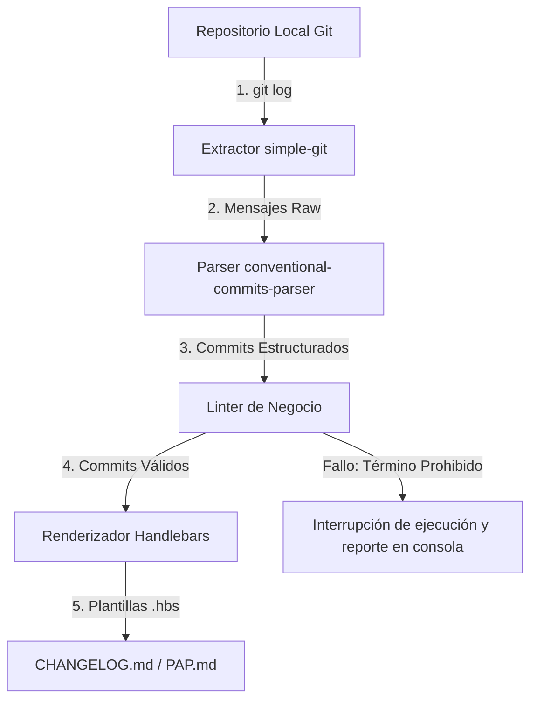

# Especificación de Requisitos de Software (ERS)
## Proyecto: CLI de Documentación Automática (tu-doc-cli)

---

## 1. Introducción

### 1.1 Propósito
Este documento describe en detalle las especificaciones y requisitos funcionales y no funcionales para el desarrollo del **CLI de Documentación Automática** (`tu-doc-cli`). El objetivo es servir como la única fuente de verdad y guiar tanto al Agente de Desarrollo Core en la codificación como al Agente de Pruebas en el diseño de los escenarios de validación.

### 1.2 Alcance del Producto
La herramienta es una interfaz de línea de comandos (CLI) escrita para Node.js que procesa el historial de commits de un repositorio local de Git para generar automáticamente entregables de documentación (`CHANGELOG` y `PAP`) basados estrictamente en la convención *Conventional Commits*. El CLI no depende de inteligencia artificial, garantizando una salida determinista y reglas estáticas de validación léxica de negocio.

---

## 2. Descripción General

### 2.1 Perspectiva del Producto
El CLI se ejecuta localmente en la terminal de desarrollo y lee la información del repositorio git local. Se distribuye mediante un paquete NPM ejecutable globalmente o a través de `npx`.

### 2.2 Funciones del Producto
1.  **Extracción semántica de commits:** Obtención programática del historial Git filtrando por tags o commits de inicio.
2.  **Parseo estructurado:** Desestructuración de mensajes en componentes semánticos (tipo, scope, subject, body, footer).
3.  **Linter estático de negocio:** Validación léxica mediante reglas de dominio configurables (rechazo de términos inadecuados y validación de tipos obligatorios).
4.  **Generación de entregables:** Agrupación y renderizado modular de los datos empleando plantillas preestablecidas.

---

## 3. Requisitos Específicos

### 3.1 Requisitos Funcionales (RF)

#### **RF-1: Interfaz de Comandos de Consola (CLI)**
*   **Descripción:** El sistema debe proveer una interfaz de comandos de terminal estructurada mediante la librería `commander`.
*   **Especificación:** El comando principal debe ser `tu-doc-cli generate <tipo>`, donde `<tipo>` solo acepta los valores `changelog` o `pap`. Si se introduce un valor diferente, el CLI debe terminar con un error descriptivo en la consola.

#### **RF-2: Rango de Análisis Personalizado (`--from` y `--to`)**
*   **Descripción:** El CLI debe permitir establecer los límites inferior y superior para el rango de commits a extraer de Git.
*   **Especificación:** Acepta el flag `--from <referencia>` (límite inferior/inicio) y el flag `--to <referencia>` (límite superior/fin), donde `<referencia>` puede ser un tag, un hash de commit o una rama.
    *   Si no se provee `--from`, la extracción leerá desde el último Tag existente hasta la referencia superior; en caso de no existir ningún Tag, extraerá desde el primer commit del historial.
    *   Si no se provee `--to`, se asumirá por defecto `HEAD`.

#### **RF-3: Filtrado por Componente/Módulo (`--scope`)**
*   **Descripción:** Permite restringir la salida de la documentación a un subconjunto de commits.
*   **Especificación:** Acepta la bandera `--scope <nombre_scope>`. Al ser provisto, solo los commits cuyo *scope* parseado sea exactamente igual a `nombre_scope` se incluirán en el entregable final.

#### **RF-4: Simulación de Operación (`--dry-run`)**
*   **Descripción:** Permite validar el proceso completo sin realizar cambios en el sistema de archivos del usuario.
*   **Especificación:** Si se incluye la bandera `--dry-run`, el CLI realizará la extracción, parseo y linter. En lugar de escribir el archivo final en disco, imprimirá el Markdown renderizado directamente en la salida estándar de la consola.

#### **RF-5: Extracción de Historial de Git**
*   **Descripción:** El sistema debe conectarse localmente con la base de datos de Git del directorio de trabajo.
*   **Especificación:** Usará la librería `simple-git` para ejecutar de manera programática comandos de obtención de logs en formato raw, respetando los rangos configurados en el CLI.
*   **Control de Errores y Casos Borde:**
    *   **Ausencia de Repositorio:** Si la carpeta actual no es un repositorio Git válido o no tiene la carpeta `.git` inicializada, el sistema debe abortar inmediatamente la ejecución con un código de salida `1` e informar del error en color rojo (`picocolors.red`).
    *   **Historial de Commits Vacío:** Si el repositorio está inicializado pero no cuenta con historial de commits (ningún commit en la rama actual), el sistema debe reportar el error en rojo y salir con código `1`.
    *   **Referencias '--from' o '--to' Inválidas o Inexistentes:** Si el tag, rama o hash especificado en la bandera `--from` o `--to` no existe en el repositorio local, el sistema debe abortar en rojo indicando que la referencia es inválida, y salir con código `1`.

#### **RF-6: Desestructuración y Parseo de Commits**
*   **Descripción:** Los mensajes de commit se deben estructurar formalmente.
*   **Especificación:** Utilizará `conventional-commits-parser` para estructurar cada mensaje de commit recuperado en un objeto JSON con los siguientes campos: `type` (tipo), `scope` (ámbito/módulo), `subject` (resumen), `body` (cuerpo del cambio), y `notes` (notas para Breaking Changes).

#### **RF-7: Linter de Negocio (Reglas de Validación)**
*   **Descripción:** Cada commit parseado debe validar reglas semánticas y léxicas antes de continuar en el pipeline.
*   **Especificación:**
    *   **Estructura Obligatoria:** Todo commit debe incluir obligatoriamente los campos `type` y `subject`.
    *   **Tipos Permitidos:** El tipo de commit debe existir dentro de la lista de tipos válidos configurados (por defecto: `feat`, `fix`, `docs`, `style`, `refactor`, `perf`, `test`, `build`, `ci`, `chore`, `revert`).
    *   **Filtro Léxico (Términos Prohibidos):** El CLI no debe permitir palabras informales, vulgares o de riesgo corporativo en el subject ni en el body. Específicamente, rechazará de forma insensible a mayúsculas: `"fraude"`, `"hack"`, `"error estúpido"`, y `"temporal"`.
    *   **Mensaje de Sugerencia:** Si se encuentra un término prohibido, el CLI debe abortar la ejecución inmediatamente, retornar un código de error de proceso (`process.exit(1)`) e imprimir una sugerencia clara de reemplazo de acuerdo a la configuración:
        *   `fraude` $\rightarrow$ sugerir: `riesgoso`
        *   `hack` $\rightarrow$ sugerir: `mitigación`
        *   `error estúpido` $\rightarrow$ sugerir: `corrección de flujo`
        *   `temporal` $\rightarrow$ sugerir: `ajuste de diseño`

#### **RF-8: Clasificación y Generación de CHANGELOG**
*   **Descripción:** Generación del historial estructurado de cambios de cara al usuario final.
*   **Especificación:**
    *   **Filtros:** Solo incluirá commits cuyo tipo sea `feat`, `fix`, `perf`, o `refactor`. Se omiten el resto para evitar ruido.
    *   **Agrupación:** Organizará los commits en secciones claras por su tipo (ej. "Nuevas Características", "Corrección de Errores", "Mejoras de Rendimiento").
    *   **Breaking Changes:** Si un commit tiene cambios disruptivos (indicado por un tag `!` en el tipo o notas de `BREAKING CHANGE` en el pie de página), este se colocará prioritariamente en una sección destacada al inicio de la versión.

#### **RF-9: Clasificación y Generación de PAP (Procedimiento de Puesta en Producción)**
*   **Descripción:** Generación de la bitácora técnica de cambios a nivel de infraestructura para el despliegue en producción.
*   **Especificación:**
    *   **Filtros:** Solo incluirá commits con tipo `ci`, `build` o commits que impacten directamente componentes de infraestructura y ambiente (ej. refactors o fixes cuyo scope sea `db`, `infra`, `docker`, o `config`).
    *   **Agrupación:** Agrupará y estructurará el reporte en base a los *scopes* (módulos) de los commits.

#### **RF-10: Renderizado Modular de Plantillas**
*   **Descripción:** Las plantillas de salida deben ser personalizables.
*   **Especificación:** El generador utilizará el motor de plantillas `handlebars` cargando los archivos `.hbs` definidos para cada tipo (`templates/changelog.hbs` y `templates/pap.hbs`), inyectando los datos de forma limpia en archivos markdown resultantes.

---

## 4. Requisitos No Funcionales (RNF)

#### **RNF-1: Ejecutabilidad e Instalación**
*   El CLI debe ser ejecutable mediante la configuración en `"bin"` del `package.json`, respondiendo al comando local `tu-doc-cli` tras un `npm link` o mediante la ejecución vía `npx`.

#### **RNF-2: Portabilidad del Entorno**
*   La herramienta debe desarrollarse utilizando Javascript puro usando ES Modules nativos (`"type": "module"` en `package.json`). No requiere herramientas adicionales de build o compilación (como Webpack, Babel o TypeScript).

#### **RNF-3: Determinismo y Ausencia de IA**
*   Todo el comportamiento de procesamiento de commits, validaciones y renderizado debe ser completamente determinista. No se permite el uso de llamadas a API de Modelos de Lenguaje (LLMs) ni dependencias heurísticas basadas en IA.

#### **RNF-4: Reporte Visual en Consola**
*   El CLI debe reportar errores y progreso usando colores semánticos en la terminal mediante la librería `picocolors`:
    *   **Rojo:** Errores críticos y fallas del linter.
    *   **Verde:** Finalización exitosa del proceso.
    *   **Amarillo / Cian:** Avisos, modos de simulación (dry-run) y advertencias menores.
