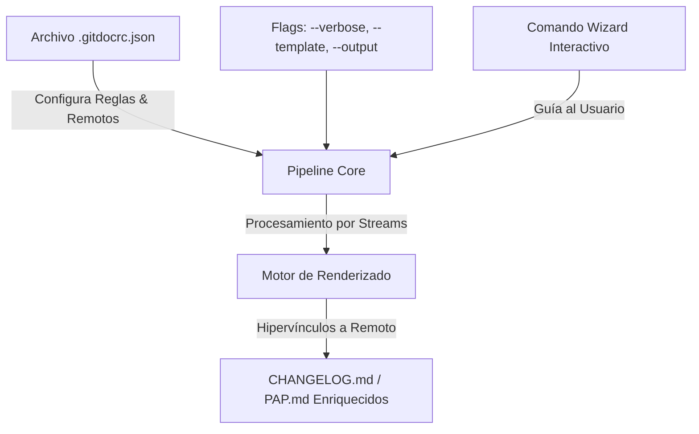

# Especificación de Requisitos de Software (ERS) - Fase 2
## Proyecto: CLI de Documentación Automática (tu-doc-cli)

---

## 1. Introducción

### 1.1 Propósito
Este documento define los requisitos funcionales y no funcionales para la **Fase 2** del CLI de Documentación Automática (`tu-doc-cli`). El objetivo de esta fase es extender las capacidades del producto agregando personalización local por proyecto, enriqueciendo sustancialmente el contenido técnico de los entregables (`CHANGELOG` y `PAP`), permitiendo hipervínculos a repositorios remotos, mejorando la escalabilidad de memoria para monorepos y agregando una interfaz interactiva tipo Wizard.

---

## 2. Descripción General de Nuevas Funciones

---

## 3. Requisitos Específicos (Fase 2)

### 3.1 Requisitos Funcionales (RF)

#### **RF-11: Configuración Local por Proyecto (`.gitdocrc.json`)**
*   **Descripción:** El CLI debe permitir leer reglas de validación y configuraciones específicas desde un archivo JSON local en la raíz del proyecto analizado.
*   **Especificación:**
    *   El sistema buscará un archivo `.gitdocrc.json` en la raíz del directorio de ejecución.
    *   Si existe, combinará las reglas predeterminadas (`config/rules.json`) con las del archivo local (el archivo local tiene precedencia).
    *   Permitirá configurar:
        *   `allowedTypes`: Extender o sobrescribir tipos de commit.
        *   `forbiddenTerms`: Términos prohibidos locales y sus respectivas sugerencias corporativas.
        *   `infraScopes`: Scopes que clasifican commits como infraestructura para el PAP (ej. `["db", "infra", "config", "docker", "k8s"]`).
        *   `remoteUrl`: URL base del repositorio remoto (ej. `https://github.com/usuario/repo`).

#### **RF-12: Ruta de Salida Personalizable (`--output` / `-o`)**
*   **Descripción:** Permitir al usuario definir la ruta y nombre del archivo de salida para la documentación generada.
*   **Especificación:**
    *   Aceptar la opción `--output <ruta>` o `-o <ruta>` en el comando `generate`.
    *   De no ser provista, se mantendrá la ruta por defecto (`CHANGELOG.md` o `PAP.md` en el directorio de trabajo).
    *   El CLI debe crear directorios intermedios si no existen antes de escribir el archivo.

#### **RF-13: Personalización de Plantillas (`--template` / `-t`)**
*   **Descripción:** Permitir la inyección de plantillas Handlebars personalizadas externas.
*   **Especificación:**
    *   Aceptar la opción `--template <ruta_a_hbs>` o `-t <ruta_a_hbs>`.
    *   Si se proporciona, el CLI cargará e inyectará los datos estructurados en dicha plantilla en lugar de las predeterminadas del sistema.

#### **RF-14: Verbosidad en el CHANGELOG (`--verbose`)**
*   **Descripción:** Permitir incluir detalles explicativos del cuerpo (`body`) del commit en el reporte del Changelog.
*   **Especificación:**
    *   Aceptar la bandera `--verbose` o `-v`.
    *   Si se activa, el renderizador inyectará el `body` de cada commit como un bloque de texto anidado o sub-viñeta debajo del subject correspondiente, mejorando la descripción de la funcionalidad para el usuario.

#### **RF-15: Procedimiento de Puesta en Producción (PAP) Enriquecido**
*   **Descripción:** El PAP debe dejar de ser una lista simple de commits de infraestructura y proveer información detallada y estructurada para el operador de despliegue.
*   **Especificación:** El generador estructurará el PAP en base a cuatro secciones bien definidas por componente/scope:
    1.  **Impacto y Descripción:** Resumen técnico extraído de los campos `subject` y `body` del commit de infraestructura.
    2.  **Instrucciones de Ejecución / Migraciones:** El parser escaneará el cuerpo del commit buscando instrucciones clave en formato markdown (bloques de código o líneas que inicien con palabras clave como `RUN:`, `MIGRATE:`, `EXECUTE:`) para listarlas prioritariamente como pasos de despliegue.
    3.  **Plan de Marcha Atrás (Rollback):** Agrupará y listará de forma explícita las instrucciones de reversión detectadas bajo el tag `ROLLBACK:` en los cuerpos de los commits, o listará los commits de tipo `revert` asociados.
    4.  **Pruebas de Humo (Verification):** Extraerá instrucciones del tag `VERIFY:` para listar los comandos que el operador debe correr para verificar el correcto funcionamiento del módulo desplegado.

#### **RF-16: Vinculación y Trazabilidad a Repositorios Remotos**
*   **Descripción:** Generación automática de hipervínculos hacia el sistema de control de versiones web (GitHub, GitLab, etc.).
*   **Especificación:**
    *   Si se configura la propiedad `remoteUrl` en el `.gitdocrc.json`, el renderizador modificará los entregables para:
        *   Enlazar cada hash de commit a su vista de diferencias remota (ej. `[hash](https://github.com/usuario/repo/commit/hash)`).
        *   Detectar referencias a Issues o Pull Requests (`#123` o `GH-123`) en los subjects/bodies y enlazarlos dinámicamente a la URL de incidentes correspondiente (ej. `[#123](https://github.com/usuario/repo/issues/123)`).

#### **RF-17: Escalabilidad mediante Flujo de Streams / Iteradores**
*   **Descripción:** Optimizar el consumo de memoria para soportar monorepositorios y repositorios con historiales masivos de commits.
*   **Especificación:**
    *   Refactorizar el pipeline de extracción y parseo para evitar el almacenamiento de todo el historial en un único arreglo en memoria.
    *   El módulo de Git utilizará flujos (streams) o generadores asíncronos (`async generators` de ES6) para extraer, parsear y validar commit a commit de manera secuencial y por lotes pequeños, canalizando la memoria de forma eficiente.

#### **RF-18: Asistente Interactivo de Consola (Wizard CLI)**
*   **Descripción:** Proporcionar una alternativa guiada e interactiva para la configuración y generación de documentación.
*   **Especificación:**
    *   Implementar el comando `tu-doc-cli wizard`.
    *   Mediante preguntas interactivas paso a paso en consola (usando la librería `prompts` u homóloga):
        *   Permitirá inicializar un archivo de configuración `.gitdocrc.json` personalizado.
        *   Guiará al usuario en la selección del tipo de reporte (`changelog`/`pap`), filtros de scopes, rangos de tags y modo de previsualización antes de persistir la información.

---

## 4. Requisitos No Funcionales (RNF)

#### **RNF-5: Consumo de Memoria Optimizado**
*   El consumo de memoria Heap del proceso durante el análisis de historiales de más de 10,000 commits no debe exceder los 100 MB, garantizado por la arquitectura de streams del Hito 9.

#### **RNF-6: Compatibilidad de Hipervínculos**
*   Los enlaces remotos autogenerados deben ser válidos y cumplir con los formatos estándar de Markdown soportados por los visores nativos de GitHub, GitLab y extensiones de VS Code.
