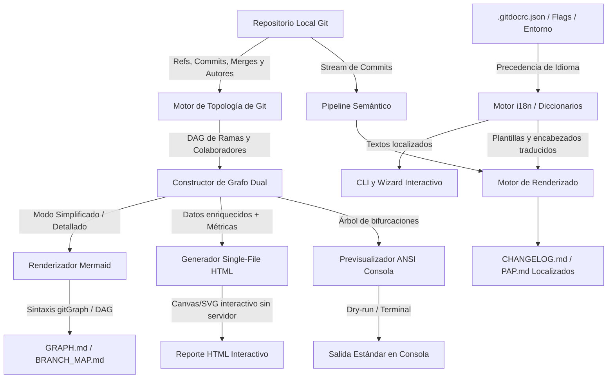

# Especificación de Requisitos de Software (ERS) - Fase 3
## Proyecto: CLI de Documentación Automática (tu-doc-cli)

---

## 1. Introducción

### 1.1 Propósito
Este documento define con precisión formal los requisitos funcionales y no funcionales para la **Fase 3** del CLI de Documentación Automática (`tu-doc-cli`). Tras haber consolidado la extracción semántica y el linter en la Fase 1, así como la configuración por proyecto, plantillas enriquecidas, procesamiento por streams y el asistente Wizard en la Fase 2, esta tercera fase expande la herramienta hacia dos ejes primordiales:
1. **Internacionalización y Soporte Multilenguaje Integral (i18n):** Dotar a la herramienta de capacidad bilingüe nativa (Español / Inglés) y arquitectura de diccionarios extensibles tanto en los entregables generados como en las interfaces de consola y del Wizard interactivo.
2. **Rastreo y Visualización Topológica de Grafos de Git:** Proporcionar una capacidad de auditoría, inspección y mapeo visual (similar a GitLens pero orientada a entregables y reportes desacoplados) que permita rastrear cómo múltiples colaboradores han desarrollado ramas en paralelo, cómo convergen e interactúan entre sí, mediante un enfoque híbrido compuesto por diagramas Markdown (Mermaid) y un visor web interactivo en HTML 100% autocontenido.

### 1.2 Alcance del Producto
La versión de Fase 3 mantiene la filosofía de ejecución local, determinista y sin dependencias de servicios en la nube ni modelos generativos de IA en tiempo de ejecución. Toda la reconstrucción de la topología del grafo y la atribución de contribuciones de colaboradores se deriva analíticamente a partir de la base de datos de objetos y referencias de Git local, complementada con un motor de renderizado dual (Markdown nativo y visor HTML gráfico interactivo).

---

## 2. Descripción General de Nuevas Funciones

El pipeline de la Fase 3 incorpora un módulo de **Resolución de Idioma (i18n Engine)** transversal a todo el sistema y un nuevo subsistema de **Extracción Topológica de Git (Graph Engine)** que coexiste con el pipeline semántico tradicional.



---

## 3. Requisitos Específicos (Fase 3)

### 3.1 Requisitos Funcionales (RF)

#### **RF-19: Motor de Internacionalización y Carga de Diccionarios (i18n Core)**
*   **Descripción:** El sistema debe incorporar un motor centralizado de localización capaz de resolver textos y mensajes dinámicamente según el idioma configurado.
*   **Especificación:**
    *   **Idiomas Nativos:** El sistema debe incluir catálogos de traducción nativos y completos para **Español (`es`)** e **Inglés (`en`)**.
    *   **Jerarquía de Precedencia:** La resolución del idioma activo se determinará en el siguiente orden estricto de prioridad:
        1. Bandera explícita en línea de comandos: `--lang <código>` (ej. `--lang en` o `--lang es`).
        2. Configuración en archivo local `.gitdocrc.json` bajo la propiedad `"locale"` o `"language"`.
        3. Detección del idioma del sistema operativo mediante variables de entorno (`LANG`, `LC_ALL`, `LC_MESSAGES`) o la API nativa `Intl.DateTimeFormat().resolvedOptions().locale`.
        4. Valor de respaldo (*fallback*): Inglés (`en`).
    *   **Extensibilidad y Sobrescritura de Diccionarios:** Permitir que los usuarios definan claves adicionales o sobrescriban traducciones corporativas desde el `.gitdocrc.json` mediante un bloque `"i18n"`:
        ```json
        {
          "locale": "es",
          "i18n": {
            "es": {
              "sections.feat": "Funcionalidades Principales"
            },
            "fr": {
              "sections.feat": "Nouvelles Fonctionnalités"
            }
          }
        }
        ```

#### **RF-20: Localización de Entregables y Plantillas Multilenguaje**
*   **Descripción:** Todos los documentos generados por el CLI (`CHANGELOG.md`, `PAP.md` y `GRAPH.md`) deben renderizarse de forma íntegra en el idioma resuelto.
*   **Especificación:**
    *   Los títulos de sección canónicos del Changelog se traducirán según el idioma activo:
        *   `feat` $\rightarrow$ "Nuevas Características" (`es`) / "Features" (`en`).
        *   `fix` $\rightarrow$ "Correcciones de Bugs" (`es`) / "Bug Fixes" (`en`).
        *   `perf` $\rightarrow$ "Mejoras de Rendimiento" (`es`) / "Performance Improvements" (`en`).
        *   `refactor` $\rightarrow$ "Refactorizaciones" (`es`) / "Code Refactoring" (`en`).
        *   `breakingChanges` $\rightarrow$ "⚠️ Cambios Disruptivos" (`es`) / "⚠️ Breaking Changes" (`en`).
    *   Los encabezados y etiquetas del Procedimiento de Puesta en Producción (PAP) deben adaptarse al idioma:
        *   "Procedimiento de Puesta en Producción" $\rightarrow$ "Production Deployment Procedure".
        *   "Componente" $\rightarrow$ "Component".
        *   "Ejecución" $\rightarrow$ "Execution".
        *   "Marcha Atrás" $\rightarrow$ "Rollback".
        *   "Pruebas de Humo" $\rightarrow$ "Smoke Tests / Verification".

#### **RF-21: Localización de la Interfaz CLI y Asistente Interactivo (Wizard)**
*   **Descripción:** La experiencia de usuario en la terminal (mensajes de ayuda, retroalimentación y preguntas interactivas del Wizard) debe presentarse en el idioma activo.
*   **Especificación:**
    *   Las descripciones de comandos y opciones registradas en `commander` deben estar traducidas.
    *   Las salidas de consola con colores (`picocolors`) para estados de éxito (`✅`), advertencia (`⚠️`) y error (`❌`) deben responder a claves del diccionario i18n.
    *   Todas las preguntas, opciones de selección múltiple, confirmaciones y mensajes de validación ejecutados a través de `@inquirer/prompts` dentro de `tu-doc-cli wizard init` y `tu-doc-cli wizard generate` deben mostrarse en el idioma seleccionado por el usuario o detectado del sistema.
    *   En el Wizard interactivo se debe ofrecer una pregunta inicial de selección de idioma si este no ha sido explícitamente fijado en la configuración del proyecto.

#### **RF-22: Extracción Topológica de Ramas, Merges y Atribución de Colaboradores**
*   **Descripción:** El CLI debe analizar la topología profunda del grafo del repositorio de Git local para identificar ramas, bifurcaciones, fusiones (merges) y autores que han participado en su desarrollo.
*   **Especificación:**
    *   **Ámbito de Referencias:** Analizará por defecto todas las ramas locales y de seguimiento remoto (`--all`), detectando su punto de divergencia (*fork point*) respecto a la rama base (ej. `main`, `master` o `develop`).
    *   **Detección de Colaboradores:** Para cada rama identificada, el sistema extraerá y asociará:
        *   Lista de autores únicos que han commiteado en dicha rama (Nombre, Email).
        *   Cantidad de commits aportados por cada colaborador en dicha rama.
        *   Rango temporal de actividad (primer commit y último commit del colaborador).
        *   Scopes de Conventional Commits modificados por cada autor.
    *   **Filtros Configurables:** El sistema permitirá filtrar y acotar el análisis mediante:
        *   `--branch <nombre>`: Limitar el grafo a una rama específica y sus ancestros directos.
        *   `--author <patrón>`: Filtrar únicamente ramas o commits donde haya participado un desarrollador específico.
        *   `--since <fecha>` / `--until <fecha>`: Acotar la ventana temporal de análisis.
        *   `--from <ref>` / `--to <ref>`: Limitar el rango de commits analizados.

#### **RF-23: Generación de Entregable de Grafo en Markdown con Mermaid (`GRAPH.md`)**
*   **Descripción:** El sistema debe compilar la información de topología y desarrollo colaborativo en un documento Markdown que incorpore diagramas Mermaid nativos.
*   **Especificación:**
    *   El archivo de salida por defecto será `GRAPH.md` (configurable mediante `-o, --output`).
    *   **Compatibilidad:** El diagrama debe emplear sintaxis estándar de Mermaid (`gitGraph` o diagrama de flujo DAG `graph LR` / `flowchart TD`) para garantizar renderizado visual automático en GitHub, GitLab, Azure DevOps y visores de Markdown.
    *   **Doble Granularidad:**
        1. **Modo Detallado (por defecto):** Representa cada commit relevante con su hash acortado, tipo semántico, autor asociado, puntos de bifurcación y commits de merge entre ramas.
        2. **Modo Simplificado (`--simplified`):** Colapsa los commits individuales para mostrar exclusivamente el mapa de relaciones entre ramas (cuándo se desprendió una rama de otra y dónde fue fusionada) junto a un bloque resumen con la lista de colaboradores que implementaron cambios en cada una de ellas.
    *   **Tablas de Resumen de Colaboradores:** El documento Markdown debe incluir tablas estructuradas al final del grafo resumiendo las contribuciones por rama y autor:
        *   Rama, Colaboradores, N° de Commits, Tipos de Cambios predominantes (`feat`, `fix`, etc.) y Estado de la Rama (Activa / Fusionada / Divergente).

#### **RF-24: Visor Gráfico Interactivo Standalone en HTML (`--html`)**
*   **Descripción:** Permitir la exportación de un reporte visual interactivo en un archivo HTML completamente autocontenido.
*   **Especificación:**
    *   Al utilizar la bandera `--html` (o `-H`) en el comando `graph`, el sistema generará un archivo (por defecto `GRAPH.html` o ruta especificada en `--output`).
    *   **Autocontención Cero-Servidor:** El archivo generado debe ser un *single-file bundle* (HTML con CSS y lógica JavaScript integrados o mediante librerías visuales confiables) capaz de ser abierto directamente con doble clic en cualquier navegador web moderno mediante el protocolo `file:///` sin requerir servidor HTTP local en segundo plano ni dependencias de NodeJS instaladas en la máquina que lo visualice.
    *   **Funcionalidades Interactivas del Visor:**
        *   **Exploración dinámica:** Soporte de zoom, paneo y arrastre del grafo de ramas.
        *   **Alternador de Granularidad:** Interruptor (*toggle switch*) en la interfaz para alternar en vivo entre la vista **Simplificada** (solo ramas y autores) y la vista **Detallada** (todos los commits con hash y mensaje).
        *   **Filtro Interactivo de Colaboradores:** Menú lateral o barra superior que permita resaltar u ocultar las ramas y commits asociados a un trabajador específico para evaluar su impacto.
        *   **Ficha de Inspección:** Al hacer clic sobre un nodo de commit o rama, desplegar un panel lateral con los detalles completos del autor, fecha, Conventional Commit parseado, archivos/scopes modificados y enlace remoto si `remoteUrl` está configurado.

#### **RF-25: Comando CLI Unificado (`tu-doc-cli graph`), Pipeline y Soporte en Wizard**
*   **Descripción:** La funcionalidad del grafo debe estar disponible como comando de primer nivel, como variante del generador estándar y dentro del asistente interactivo.
*   **Especificación:**
    *   **Comando dedicado:** `tu-doc-cli graph` que acepta banderas como `--simplified`, `--html`, `--all`, `--branch <nombre>`, `--author <autor>`, `-o, --output <ruta>`, y `--lang <código>`.
    *   **Comando generate:** `tu-doc-cli generate graph` como tercera variante junto a `changelog` y `pap`.
    *   **Wizard Interactivo:** Incorporar una opción dedicada en `tu-doc-cli wizard` para guiar al usuario en la selección interactiva de ramas a mapear, selección de colaboradores, formato de salida (Markdown Mermaid o HTML interactivo) y nivel de detalle deseado.

#### **RF-26: Previsualización de Árbol y Grafo en Consola Terminal**
*   **Descripción:** Proporcionar una representación gráfica en consola para ejecuciones con la bandera `--dry-run` o en modo verboso.
*   **Especificación:**
    *   Imprimir en la salida estándar (`stdout`) una estructura de árbol en caracteres Unicode/ANSI (estilo `git log --graph --oneline` enriquecido) indicando los nombres de ramas en diferentes colores, los autores entre paréntesis y los hashes de commit.

---

## 4. Requisitos No Funcionales (RNF)

#### **RNF-7: Rendimiento y Límite de Complejidad Topológica**
*   El cálculo del grafo topológico y la extracción de métricas de colaboradores en repositorios con hasta **50 ramas activas** y más de **5,000 commits** no debe superar los **3 segundos** de procesamiento en una estación de desarrollo estándar, garantizando una ejecución fluida en pipelines de CI/CD.

#### **RNF-8: Autocontención y Portabilidad del Visor HTML**
*   El archivo HTML interactivo generado no debe depender de conexiones de red activas para su visualización básica ni de un servidor web local en ejecución, siendo completamente portable para almacenamiento en servidores de artefactos, auditorías técnicas o compartición por correo electrónico.

#### **RNF-9: Validez Estricta de Sintaxis Mermaid y Escape de Caracteres**
*   Los diagramas generados en Markdown deben cumplir rigurosamente con la gramática de Mermaid.js. El generador debe sanitizar y escapar caracteres especiales en mensajes de commit, nombres de autor y nombres de ramas (tales como comillas, barras diagonales, corchetes y paréntesis) para prevenir rupturas sintácticas en los visores de GitHub y VS Code.

---

## 5. Matriz de Trazabilidad y Asignación a Hitos

| Requisito Funcional / No Funcional | Descripción Resumida | Hito de Implementación |
| :--- | :--- | :--- |
| **RF-19** | Motor i18n, diccionarios nativos (`es`, `en`) y precedencia | **Hito 10** |
| **RF-20** | Localización de entregables (`CHANGELOG`, `PAP`, plantillas) | **Hito 10** |
| **RF-21** | Localización de la interfaz CLI y preguntas del Wizard | **Hito 10** |
| **RF-22** | Extracción topológica de Git, análisis de ramas y colaboradores | **Hito 11** |
| **RF-23** | Generador de grafos Markdown con Mermaid (Detallado y Simplificado) | **Hito 12** |
| **RF-26** | Previsualización de árbol y grafo en terminal ANSI (`--dry-run`) | **Hito 12** |
| **RF-24** | Visor gráfico interactivo HTML autocontenido (`--html`) | **Hito 13** |
| **RF-25** | Comandos CLI (`tu-doc-cli graph`), Pipeline y Wizard interactivo | **Hito 14** |
| **RNF-7** | Rendimiento y límite de complejidad en análisis de grafos | **Hito 11** |
| **RNF-8** | Autocontención y portabilidad del archivo HTML | **Hito 13** |
| **RNF-9** | Sanitización y compatibilidad estricta de sintaxis Mermaid | **Hito 12** |
